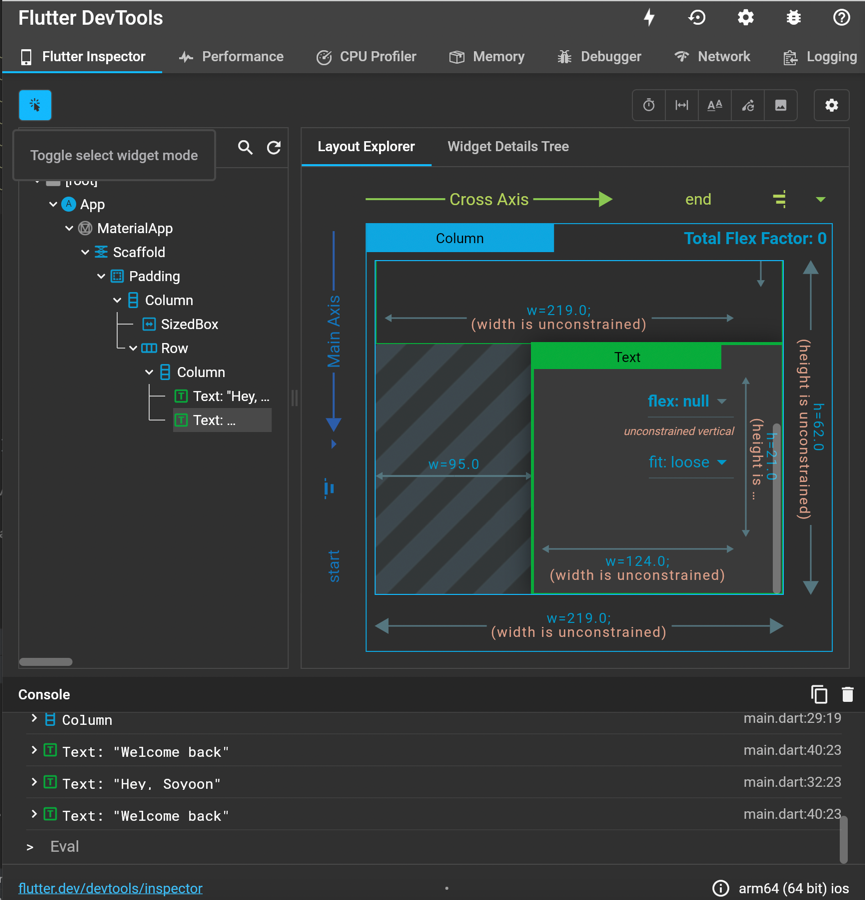
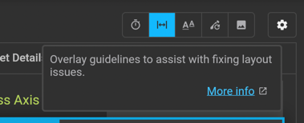

[코드](../lib/main.dart)

### Improve DX

- code actions 사용하기
- Error Lens 익스텐션 설치하기
- Flutter dev tools
    - android studio 에서
        - Flutter Dev Tools 열기        
          
        - 위젯 모드     
          
        - Overlay Guidelines 열기     
          
          

- const 자동으로 붙이기
    - vscode에서
      settings.json 에서 설정해준다.
      ```json
      {
        "editor.codeActionsOnSave": {
          "source.fixAll": true
        },
        "dart.previewFlutterUiGuides": true
      }
      ```

    - android studio 에서
        - [macro](img.png)
        - dart fix --apply lib/main.dart
        - option + enter 로 일일이..

### Widgets

- Container
    - clipBehavior : overflowed 됐을 때 처리
- Column
    - mainAxisAlignment
    - crossAxisAlignment
- Row
    - mainAxisAlignment
    - crossAxisAlignment
- SizedBox
- Padding
- Text
- Transform.translate : 위치 조정
- Transform.scale : 크기 조정
- SingleChildScrollView

